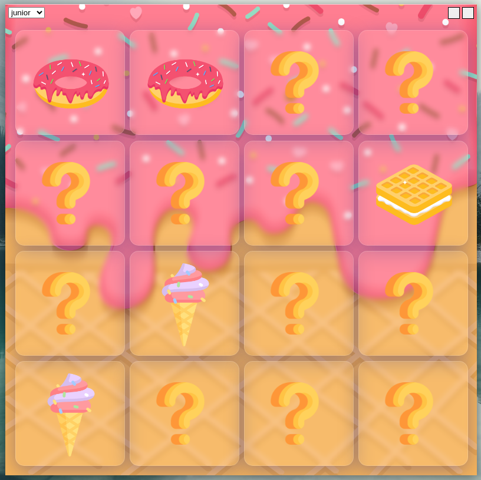
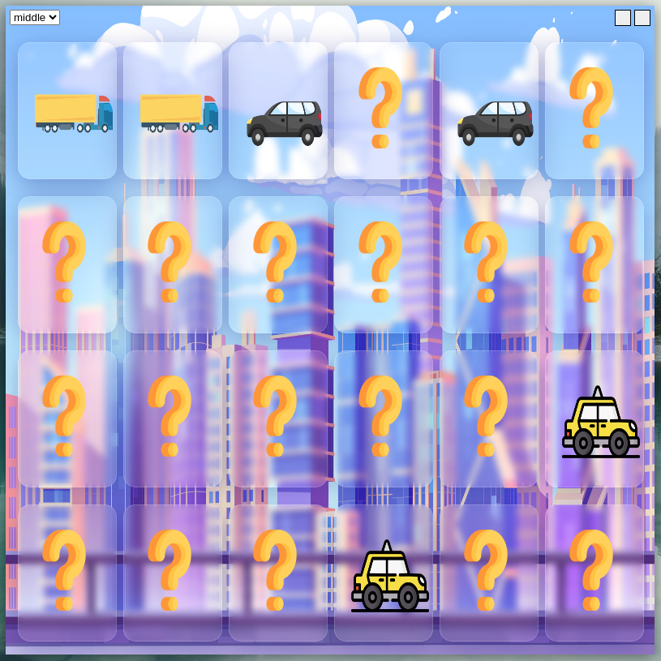
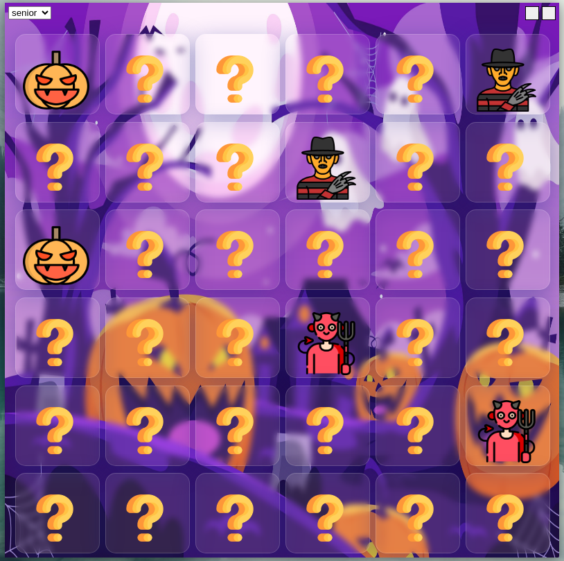

installation

1)install " npm i " dependencies

2)conversion " npm run build "

------------------------finished project---------------------------

1.0.0 The project is ready

---------------------development stage------------------------

0.0.6 everything is ready and everything works, all that remains is to package it and test for minor bugs
Work has been done to combine the main function of random placement of cards and the level function that sets the number of cells

0.0.5 left to do

1. customize CSS styles
2. customize the electronic window
3. search for bugs

0.0.4 added visual for the first level

0.0.3 the main function has been rewritten and now works correctly now we need to create 2 new levels
"I think it will be interesting !"

0.0.2 wrote the basic function (but there are problems!)

0.0.1 start development
