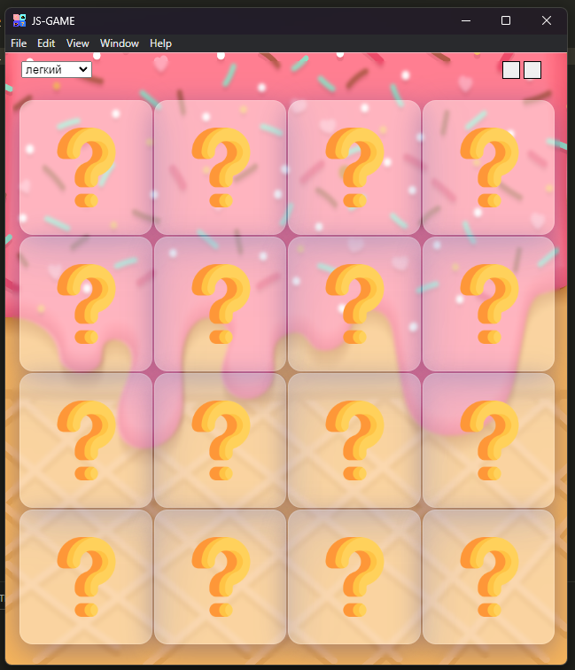

I finished today but something went wrong
and I deleted the whole project
so I'll do it again from this commit

0.0.4 added visual for the first level

0.0.3 the main function has been rewritten and now works correctly now we need to create 2 new levels
      "I think it will be interesting !"

0.0.2 wrote the basic function        (but there are problems!)

0.0.1 start development 
